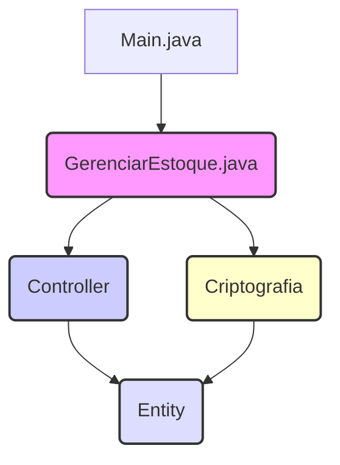

# 📦 Sistema de Gerenciamento de Estoque (Estoque)

## 🌟 Status do Projeto

[](https://www.java.com/pt-br/)
[](https://maven.apache.org/)
[](https://www.mindrot.org/projects/jBCrypt/)
[](LICENSE)

## 🎯 Visão Geral do Projeto

O **Estoque** é uma aplicação robusta de gerenciamento de inventário desenvolvida em **Java** com foco em operar via **Interface de Linha de Comando (CLI)**. O projeto serve como um excelente estudo de caso para a aplicação de **Programação Orientada a Objetos (POO)** e a organização de código utilizando o padrão **MVC (Model-View-Controller)** adaptado para um ambiente de console.

O sistema foi projetado para oferecer um controle básico, mas eficiente, de produtos e a gestão de usuários, incorporando um mecanismo de autenticação seguro através do *hashing* de senhas com a biblioteca **jBCrypt**.

## 🏛 Arquitetura e Design de Software

A arquitetura da aplicação é baseada em uma clara separação de responsabilidades, facilitando a manutenção e a escalabilidade. A estrutura de pacotes reflete um design modular, conforme detalhado abaixo:

### Diagrama de Pacotes (Representação Textual)



| Pacote | Papel no MVC (Adaptado) | Responsabilidades Chave |
| :--- | :--- | :--- |
| `br.com.Entity` | **Model** | Representação dos dados (Produto, Usuário). |
| `br.com.Controller` | **Controller** | Lógica de negócio, manipulação de dados e regras de validação. |
| `br.com.GerenciarEstoque` | **View/Controlador Principal** | Interação com o usuário (menus, inputs) e orquestração dos *Controllers*. |
| `br.com.Criptografia` | **Serviço de Segurança** | *Hashing* e verificação de senhas. |

## ✨ Funcionalidades Detalhadas

O sistema oferece um conjunto completo de ferramentas para a gestão de um pequeno estoque:

*   **Gestão de Produtos:** Funções CRUD (Criar, Ler, Atualizar, Deletar) para itens do estoque.
*   **Controle de Usuários:** Cadastro e Login seguro com *hashing* de senhas.
*   **Movimentação de Estoque:** Registro de entradas e saídas de produtos, essencial para auditoria e rastreabilidade.

## 🛠 Tecnologias e Dependências

| Tecnologia | Versão | Tipo | Propósito |
| :--- | :--- | :--- | :--- |
| **Java** | 17+ | Linguagem | Plataforma de desenvolvimento. |
| **Maven** | 3.x | Build Tool | Gerenciamento de dependências e ciclo de vida. |
| **jBCrypt** | 0.4 | Dependência | Implementação do algoritmo de *hashing* de senhas BCrypt. |

## ⚙ Pré-requisitos

Para compilar e executar o projeto, é necessário ter instalado:

*   **Java Development Kit (JDK)**: Versão 17 ou superior.
*   **Apache Maven**: Versão 3.x ou superior.

## 🚀 Instalação e Execução

### 1. Clonagem e Compilação

```bash
# 1. Clone o repositório
git clone https://github.com/GilvanPedro/Estoque.git
cd Estoque/Estoque

# 2. Compile e empacote o projeto
mvn clean install
```

### 2. Execução da Aplicação

```bash
# Execute o arquivo JAR gerado na pasta target
java -jar target/Estoque-1.0-SNAPSHOT.jar
```

## 🕹 Exemplo de Uso (CLI)

Ao iniciar a aplicação, você será solicitado a criar uma conta ou fazer login.

```
========== CRIAR CONTA ==========
Nome: Gilvan
Email: gilvan@gmail.com
Senha: ********
=================================
Usuário criado com sucesso!

========== LOGIN ==========
Email: gilvan@gmail.com
Senha: ********
===========================
Login realizado com sucesso!

========== GERENCIAR ESTOQUE ==========
1 - Adicionar Produto
2 - Listar Produtos
3 - Remover Produto
4 - Buscar Produto
0 - Voltar
Escolha uma opção: 1
Nome do Produto: Notebook
Quantidade: 10
Descrição: Laptop de alta performance
Preço: 4500.00
Produto adicionado com sucesso!
```

## 📄 Licença

Este projeto está sob a **Licença MIT**. Sinta-se à vontade para inspecionar, modificar e distribuir o código. Consulte o arquivo [LICENSE](LICENSE) para mais informações.

## 🧑‍💻 Autor

Este projeto foi desenvolvido por [Gilvan Pedro](https://github.com/GilvanPedro).
